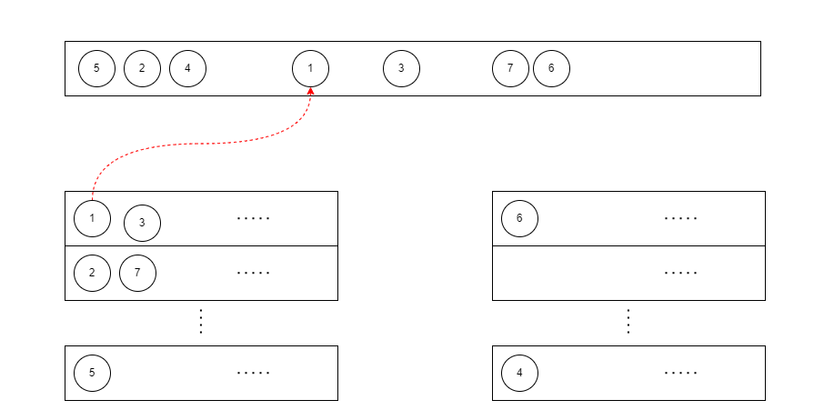

# **CS 140 Project 1: xv6 Rotating Staircase Deadline Scheduler**

## **Description**
For this collaborative Operating Systems project, we had to augment MIT's xv6 round-robin scheduler with
Con Kolivas' Rotating Staircase DeadLine (RSDL) scheduler. Main languages used were C and x86 assembly. Compilation and testing were done through Oracle VirtualBox using CS 140's prebuilt Ubuntu appliance. Modifications were
done primarily to these root files (ordered by significance):
1. `proc.c`
2. `trap.c`
3. `sysproc.c`

### **RSDL Scheduler**
The RSDL scheduler uses an Active set and an Expired set alongside the process table as scheduling heuristics
to help decide which process to run next in a more fair and heuristic manner.

The Active and Expired sets both have `N` FIFO levels (or queues) in them (think **staircase**).
Each level is given a limited level-local quantum (runtime in ticks) that is decremented as a process in that level runs.
Note that this is more relevant for the Active set. Once a level uses up its entire quantum, all processes in it are ejected and enqueued to
the level below it (level `N-1`) in the exact same order. And once all levels in the Active set uses up their entire quantum, the Active set
is swapped for the Expired set which is then made the new Active set (think **rotation**) with replenished level-local quanta.

Moreover, each process is given a limited process-local quanta.
Upon using up its entire quantum, the process (running in the Active set) moves
down a level (to level `N-1`) where it gets enqueued and its quantum is replenished (think **deadline**).
A process that is selected to run in a set's particular level is then said to be dequeued from that level.
Note that a process begins its life in a predefined level (see `rsdl.h`).

A process that expires at the bottommost level is then moved to the Expired set where it will wait for its next turn.
There are *multiple caveats* here, such as on:
- What happens when a process consumes its entire quantum as it exits (zombie!)?
- What happens when the Active set runs out of processes to run but still has nonzero level-local quanta?
- What happens when a process expires but all the levels below it has no more level-local quanta?

These are all answered in the Project Documentation and Specs, so you may want to read those for thorough awareness of these caveats.

A high-level view of RSDL is shown below. Process Control Blocks (PCBs or processes in short) are still stored in ptable.proc .
The “process” entries stored in the level queues in the `ptable.active` and the `ptable.expired` sets are
essentially just pointers to their corresponding PCBs in `ptable.proc`, and it is on these sets that RSDL
selects for processes to schedule.



### **Quick Links**
- Full project specifications are in `extras\CS140_Project1_Specs.pdf`. Please email me for access.
- Project Documentation can be found in `extras\cs140project1.pdf`.
- Video Documentation can be found [here](https://drive.google.com/file/d/1tz89OH9HZINDWIyBGx8JMmch4MLltlsT/view?usp=share_link).

## **Collaboration**
I teamed with **Jan Paul Batrina** and **Angelo Convento** for this project.
My role is mainly quality assurance with focus on optimization and debugging.
It was my job to paintstakingly test the kernel for stability and fulfillment of requirements.
Towards this, I wrote a lot of test programs, brought up edge cases and caveats, combed through many output logs, and diligently engaged
in communication with my teammates from suggestions to documentation.
Of course, to proceed with this, I had to have an in-depth understanding of how the xv6 kernel
works in both its original and modified forms.

## **Requirements**
It is suggested for you to only watch the video documentation or skim through the written documentation.

However, if you really wish to verify the results on your end, the following would be needed.
- Windows 7 or higher. Otherwise, skip the next bullet if you already have a Linux environment.
- Latest version of [WSL](https://learn.microsoft.com/en-us/windows/wsl/install) (Recommended). Alternative would be to set up a Linux environment in a Virtual Machine, but lightweight testing can be accomplished through WSL.
- Upon setting-up WSL, launch WSL entering `wsl` in a terminal, then install prerequisites by running the following:
```shell
sudo apt update

sudo apt install -y build-essential qemu-system-x86 gdb python3-pip
python3-testresources git

pip3 install gdbgui

echo "set auto-load safe-path /" >> ~/.gdbinit
```
For running tests, please directly proceed to the next section.

## **Running Tests**
Test programs were already provided for your convenience. These test programs utilize the system call `schedlog(n)` that causes all processes in each level of the sets to be printed out during program execution. But if you wish, you may write your own test programs that verifies if the RSDL scheduler behaves as expected. You may also edit the scheduler's **parameters** in `rsdl.h`.

To make use of the provided test programs:
1. Launch `wsl` on a terminal.
2. `cd` to the root directory of this project.
3. Enter `make clean`, then `make qemu-nox`. This will launch the RSDL xv6.
4. Run any of the following test programs (see files named `test_*`). For example, to run `test_priofork.c`, enter `test_priofork`. To stop the test program, press `CTRL+A` then press `x`. This exits xv6.
5. Verify the results by checking the output in the terminal. As Jan Paul also taught me, it is useful to do `make qemu nox | tee test.out` to dump `stdout` to a log file, `test.out` in this case, which one can verify later on.  

Note on `priofork(k)`: this is a system call that is very similar to `fork()` but ignores the `RSDL_STARTING_LEVEL` parameter, replacing it with `k` instead. That is, a process created using `priofork(k)` will be enqueued in level `k` of the Active set. 

---
Yenzy Urson S. Hebron

University of the Philippines Diliman

1st Semester A.Y. 2022-2023

© Course Materials by Sir Wilson Tan, Sir Juan Felipe Coronel, and Ma'am Angela Zabala

---
## **xv6 Credits**
xv6 is a re-implementation of Dennis Ritchie's and Ken Thompson's Unix
Version 6 (v6).  xv6 loosely follows the structure and style of v6,
but is implemented for a modern x86-based multiprocessor using ANSI C.

ACKNOWLEDGMENTS

xv6 is inspired by John Lions's Commentary on UNIX 6th Edition (Peer
to Peer Communications; ISBN: 1-57398-013-7; 1st edition (June 14,
2000)). See also https://pdos.csail.mit.edu/6.828/, which
provides pointers to on-line resources for v6.

xv6 borrows code from the following sources:
    JOS (asm.h, elf.h, mmu.h, bootasm.S, ide.c, console.c, and others)
    Plan 9 (entryother.S, mp.h, mp.c, lapic.c)
    FreeBSD (ioapic.c)
    NetBSD (console.c)

The following people have made contributions: Russ Cox (context switching,
locking), Cliff Frey (MP), Xiao Yu (MP), Nickolai Zeldovich, and Austin
Clements.

We are also grateful for the bug reports and patches contributed by Silas
Boyd-Wickizer, Anton Burtsev, Cody Cutler, Mike CAT, Tej Chajed, eyalz800,
Nelson Elhage, Saar Ettinger, Alice Ferrazzi, Nathaniel Filardo, Peter
Froehlich, Yakir Goaron,Shivam Handa, Bryan Henry, Jim Huang, Alexander
Kapshuk, Anders Kaseorg, kehao95, Wolfgang Keller, Eddie Kohler, Austin
Liew, Imbar Marinescu, Yandong Mao, Matan Shabtay, Hitoshi Mitake, Carmi
Merimovich, Mark Morrissey, mtasm, Joel Nider, Greg Price, Ayan Shafqat,
Eldar Sehayek, Yongming Shen, Cam Tenny, tyfkda, Rafael Ubal, Warren
Toomey, Stephen Tu, Pablo Ventura, Xi Wang, Keiichi Watanabe, Nicolas
Wolovick, wxdao, Grant Wu, Jindong Zhang, Icenowy Zheng, and Zou Chang Wei.

The code in the files that constitute xv6 is
Copyright 2006-2018 Frans Kaashoek, Robert Morris, and Russ Cox.

ERROR REPORTS

We switched our focus to xv6 on RISC-V; see the mit-pdos/xv6-riscv.git
repository on github.com.

BUILDING AND RUNNING XV6

To build xv6 on an x86 ELF machine (like Linux or FreeBSD), run
"make". On non-x86 or non-ELF machines (like OS X, even on x86), you
will need to install a cross-compiler gcc suite capable of producing
x86 ELF binaries (see https://pdos.csail.mit.edu/6.828/).
Then run "make TOOLPREFIX=i386-jos-elf-". Now install the QEMU PC
simulator and run "make qemu".